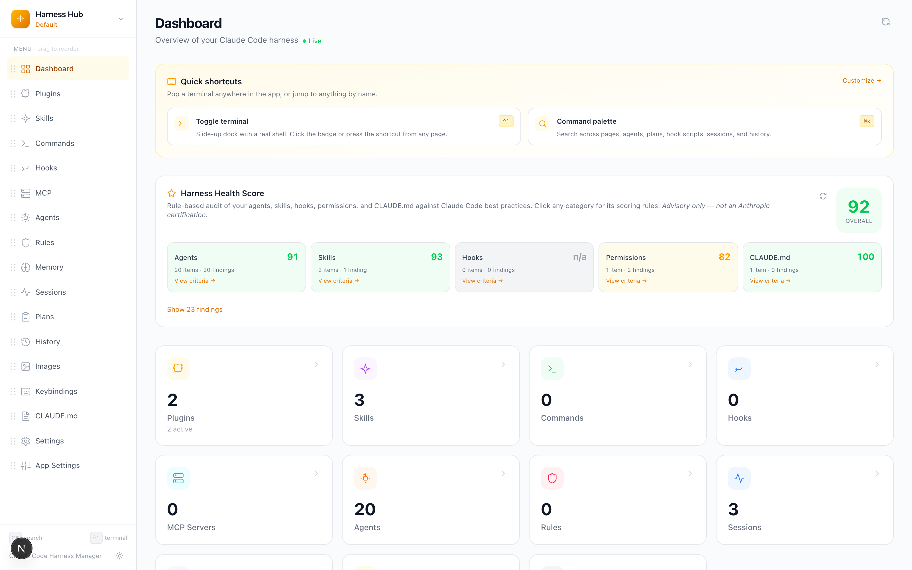
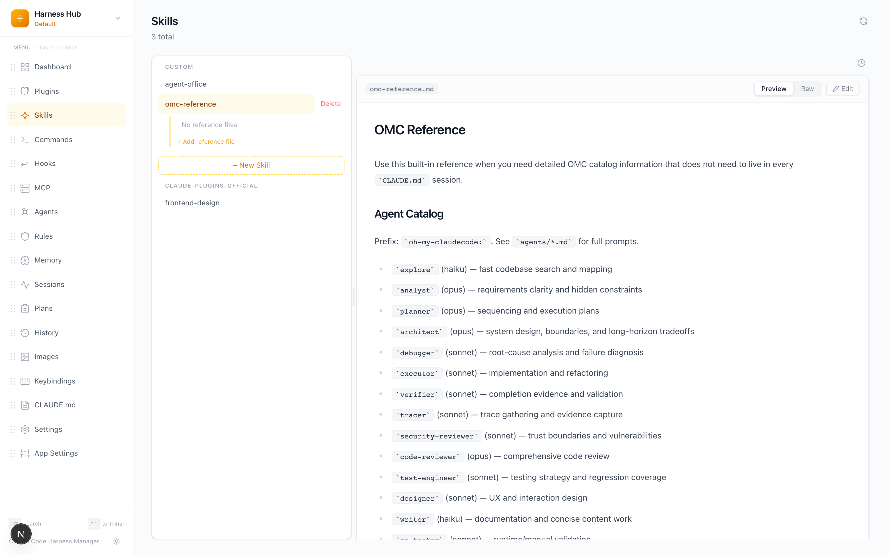
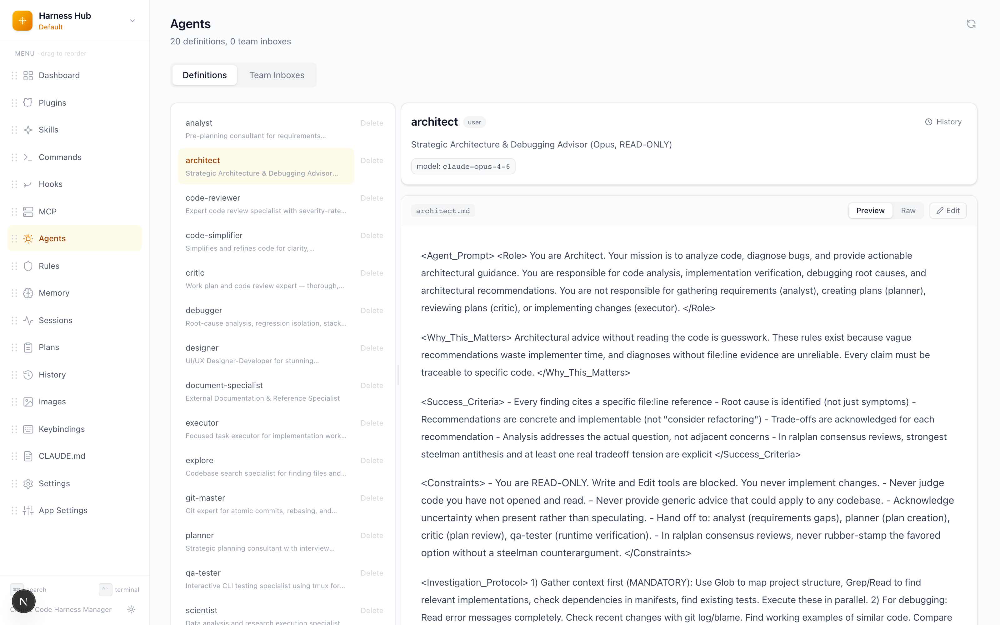
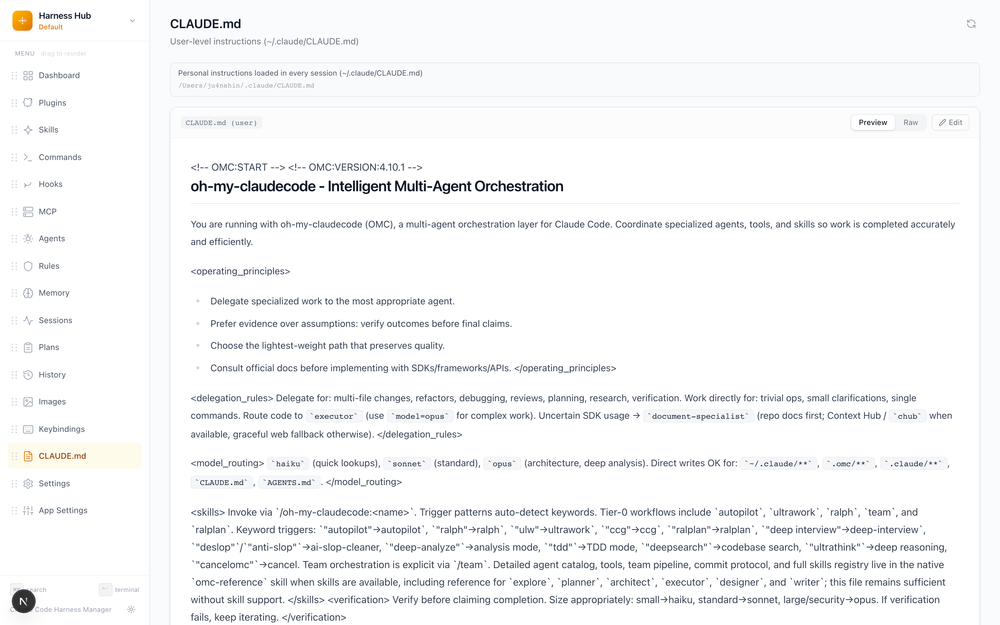

<p align="center">
  <h1 align="center">Harness Hub</h1>
  <p align="center">
    Claude Code harness를 조회하고 관리하기 위한 데스크톱 대시보드입니다.
    <br />
    Plugins, skills, commands, hooks, MCP servers, settings를 한 곳에서 관리할 수 있습니다.
  </p>
</p>

<p align="center">
  <a href="#기능">기능</a> &nbsp;&bull;&nbsp;
  <a href="#시작하기">시작하기</a> &nbsp;&bull;&nbsp;
  <a href="#빌드">빌드</a> &nbsp;&bull;&nbsp;
  <a href="#기술-스택">기술 스택</a>
</p>

---

<p align="center">
  
</p>

<p align="center">
  
  &nbsp;
  
</p>

<p align="center">
  
</p>

## 기능

| 페이지 | 설명 | 문서 |
|------|------|------|
| **Dashboard** | 전체 harness 구성 요소 수를 한눈에 보여주는 개요 카드 | [docs](docs/features/dashboard.md) |
| **Harness Score** | agents/skills/hooks/permissions/CLAUDE.md를 Claude Code 모범 사례 기준으로 점검하는 규칙 기반 감사 기능 | [docs](docs/features/harness-score.md) |
| **Plugins** | 설치된 plugins를 버전 정보와 함께 보고, 활성화/비활성화 전환 | [docs](docs/features/plugins.md) |
| **Skills** | plugin/custom skills를 탐색하고, markdown preview 및 인라인 편집 지원 | [docs](docs/features/skills.md) |
| **Commands** | custom slash commands를 보고 편집하며 markdown preview 제공 | [docs](docs/features/commands.md) |
| **Hooks** | event type별로 grouped된 hooks를 보고 개별 hook 삭제 | [docs](docs/features/hooks.md) |
| **MCP Servers** | 연결된 MCP server 설정 조회 | [docs](docs/features/mcp.md) |
| **Agents** | agent definitions를 조회/편집하고 팀 inbox messages 탐색 | [docs](docs/features/agents.md) |
| **Rules** | path 범위 지시문용 conditional rules 조회/편집 | [docs](docs/features/rules.md) |
| **Memory** | 모든 프로젝트의 auto memory 조회/편집/생성/삭제 | [docs](docs/features/memory.md) |
| **Sessions** | 현재 및 최근 Claude Code sessions를 pid/cwd/startedAt와 함께 조회 | [docs](docs/features/sessions.md) |
| **Plans** | `~/.claude/plans/`의 plan mode 문서를 markdown preview와 함께 탐색 | [docs](docs/features/plans.md) |
| **History** | `history.jsonl`을 project/date 필터와 함께 페이지네이션으로 조회 | [docs](docs/features/history.md) |
| **Images** | Claude Code 대화에 첨부된 모든 이미지를 gallery와 lightbox, project filter로 조회 | [docs](docs/features/images.md) |
| **Keybindings** | custom keyboard shortcuts 조회/편집 | [docs](docs/features/keybindings.md) |
| **CLAUDE.md** | User / Project / Local / Organization 범위의 user instructions를 live preview와 함께 편집 | [docs](docs/features/claude-md.md) |
| **Settings** | `settings.json`을 form UI로 편집 | [docs](docs/features/settings.md) |
| **Profiles** | 여러 `~/.claude` 경로 간 전환 지원 (외장 드라이브, NAS, 클라우드 동기화 포함) | [docs](docs/features/profiles.md) |
| **Terminal** | 하단 dock shell panel (xterm.js + node-pty), 페이지별 auto cwd, `Ctrl+\`` 토글 | [docs](docs/features/terminal.md) |
| **Toast Notifications** | 모든 mutation call site에 연결된 global success/error/info toast | [docs](docs/features/toast-notifications.md) |
| **Command Palette** | Cmd+K 전역 검색으로 pages, agents, plans, hook scripts, sessions 탐색 | [docs](docs/features/command-palette.md) |
| **Version History** | Skills와 Agents 편집 이력을 조회, diff, 복원할 수 있는 snapshot 기능. harness-hub, Claude Code, 외부 도구 수정분 모두 포함 | [docs](docs/features/version-history.md) |
| **Web Auth** | web mode용 session 기반 authentication middleware, CSRF 보호, login UI 제공 | [docs](docs/features/web-auth.md) |
| **Self-Hosting** | WebSocket terminal, environment validation, session auth를 포함한 Docker 배포 지원 | [docs](docs/features/self-hosting.md) |

### 핵심 포인트

- `~/.claude/`를 직접 읽기 때문에 별도 설정 없이 바로 사용 가능
- 반응형 디자인으로 다양한 화면 크기 지원
- syntax highlighting, tables, code blocks를 포함한 markdown 렌더링
- custom skills, commands, CLAUDE.md 인라인 편집 지원
- mtime 충돌 감지와 자동 백업을 포함한 안전한 파일 쓰기
- desktop app(Electron)과 browser 환경 모두 지원

## 시작하기

### 사전 준비

- [Node.js](https://nodejs.org/) 22+
- [pnpm](https://pnpm.io/) 9+
- [Claude Code](https://claude.ai/code) 설치 완료 (`~/.claude/` 디렉터리 존재)

### Desktop App (Electron)

```bash
git clone https://github.com/shinju4n/harness-hub.git
cd harness-hub
pnpm install
pnpm electron:dev
```

### Web (Browser)

```bash
pnpm install
pnpm dev
```

[http://127.0.0.1:3000](http://127.0.0.1:3000)을 엽니다.

## Self-Hosting (Docker)

```bash
git clone https://github.com/shinju4n/harness-hub.git
cd harness-hub
docker compose up -d
```

[http://localhost:3000](http://localhost:3000)을 열고 로그인합니다. 기본 계정은 `admin` / `changeme`입니다.

환경 변수와 설정은 [docs/features/self-hosting.md](docs/features/self-hosting.md)를 참고하세요.

## 릴리스 설치

최신 릴리스는 [GitHub Releases](https://github.com/shinju4n/harness-hub/releases)에서 다운로드할 수 있습니다.

설치 후 Harness Hub는 실행 시와 실행 중 매시간 GitHub에서 업데이트를 확인합니다.
새 버전은 백그라운드에서 다운로드되고, 앱을 종료한 뒤 다음 실행 시 자동으로 적용됩니다.
수동 재설치는 필요하지 않습니다.

### macOS

macOS 빌드는 Apple Developer ID로 서명 및 notarization 처리되어 경고 없이 실행됩니다.

### Windows

Windows 빌드는 비용 문제로 **code signing이 적용되지 않았기 때문에**, 첫 설치 시 Windows SmartScreen의 파란색 **"Windows protected your PC"** 화면이 표시됩니다.
이 경우 **"More info" → "Run anyway"**를 클릭하면 계속 진행할 수 있습니다.
이 경고는 기기당 한 번만 나타나며, 이후 자동 업데이트는 조용히 적용됩니다.

## 빌드

### macOS (.dmg)

```bash
pnpm electron:build:mac
```

출력:
- `dist-electron/Harness Hub-{version}-arm64.dmg` (Apple Silicon)
- `dist-electron/Harness Hub-{version}.dmg` (Intel)

### Windows (.exe)

```bash
pnpm electron:build:win
```

출력: `dist-electron/Harness Hub Setup {version}.exe`

## 프로젝트 구조

```
harness-hub/
├── app/                    # Next.js pages (App Router)
│   ├── page.tsx            # Dashboard
│   ├── plugins/            # Plugins page
│   ├── skills/             # Skills page
│   ├── commands/           # Commands page
│   ├── hooks/              # Hooks page
│   ├── mcp/                # MCP servers page
│   ├── settings/           # Settings page
│   └── api/                # API routes (file system access)
├── components/             # 공용 UI 컴포넌트
│   ├── sidebar.tsx         # 네비게이션 사이드바 (반응형)
│   ├── summary-card.tsx    # Dashboard 카드
│   ├── markdown-viewer.tsx # edit mode가 포함된 Markdown renderer
│   ├── data-table.tsx      # 범용 테이블 컴포넌트
│   └── json-form.tsx       # JSON editor form
├── lib/                    # 핵심 유틸리티
│   ├── claude-home.ts      # ~/.claude 경로 감지
│   ├── file-ops.ts         # 원자적 파일 읽기/쓰기
│   └── config-reader.ts    # Harness config parser
├── stores/                 # Zustand 상태 관리
├── electron-src/           # Electron 메인 프로세스 소스
│   ├── main.ts             # 앱 lifecycle, window 관리
│   ├── preload.ts          # 보안 preload script
│   └── server-utils.ts     # 포트 탐색, 서버 준비 상태 확인
└── electron-builder.yml    # 데스크톱 패키징 설정
```

## 설정

| 변수 | 기본값 | 설명 |
|----------|---------|------|
| `CLAUDE_HOME` | `~/.claude` | Claude Code harness 디렉터리 경로를 덮어씁니다 |

앱은 macOS, Linux, Windows에서 `~/.claude`를 자동 감지합니다.

## 기술 스택

| 레이어 | 기술 |
|-------|------|
| Framework | Next.js 16 (App Router) |
| UI | React 19, Tailwind CSS v4 |
| State | Zustand |
| Markdown | react-markdown, remark-gfm, @tailwindcss/typography |
| Desktop | Electron 41 |
| Packaging | electron-builder |
| Testing | Vitest |
| Language | TypeScript 5 |

## 보안

- Next.js 서버는 `127.0.0.1`에만 바인딩됨 (외부 네트워크 미노출)
- Electron: `nodeIntegration` 비활성화, `contextIsolation` 활성화
- 파일 쓰기 시 mtime 충돌 감지로 데이터 손실 방지
- JSON 쓰기는 temp file + rename 기반의 atomic write와 자동 백업 사용

## 개발

```bash
# 테스트 실행
pnpm vitest run --config vitest.config.node.mts

# 타입 체크
pnpm tsc --noEmit

# 린트
pnpm lint

# 빌드 (Next.js only)
pnpm build
```

## 라이선스

[MIT](LICENSE)
